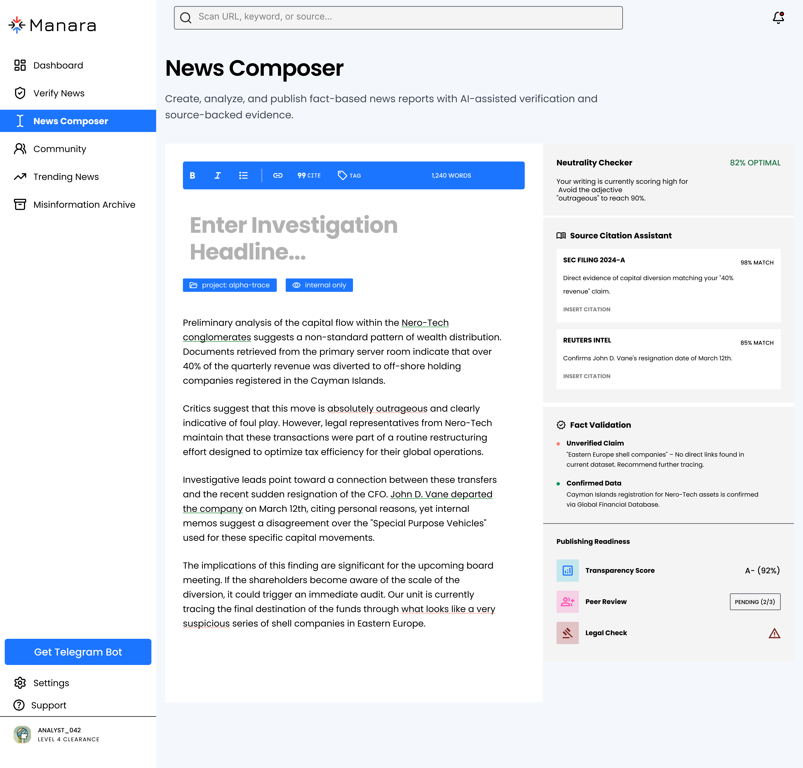

# Manara — AI-Powered Investigative Journalism Platform

> Verify, Trace, and Investigate — all in one platform.
> Manara helps journalists and researchers track news back to its original source, verify credibility, and fight misinformation.
---

# Screenshots

### Landing Page

### Login

### Sign Up — Step 1

### Sign Up — Step 2

### News_Composer

### Archive

---

# Key Features

1. AI-Powered News Verification — Analyzes text, images, and videos to assess authenticity and detect misinformation

2. Image Forensics — Identifies manipulation, deepfakes, and metadata tampering with confidence scoring

3. News Composer — A structured writing environment with AI-assisted neutrality checking and source citation

4. Misinformation Archive — A searchable database of 14,000+ debunked stories with verified fact-checking reports

5. Geographical Misinformation Map — Real-time visualization of misinformation density by region

6. Smart Source Search — Traces news origin and cross-references trusted outlets automatically

7. Community Feed — A collaborative space for journalists and fact-checkers to share findings

---

 # Built With

React · TypeScript · Tailwind CSS · Vite · React Router · Supabase
---

 # Getting Started

clone the repository and install dependencies:

git clone https://github.com/baraajuma3-lab/manara-website.git 
 
cd manara-website 

npm install 

npm run dev

---

# Author

Baraa Juma — Frontend Developer & UI/UX Designer
github.com/baraajuma3-lab

> Manara — The digital infrastructure for truth in an age of fragmented information.
---

