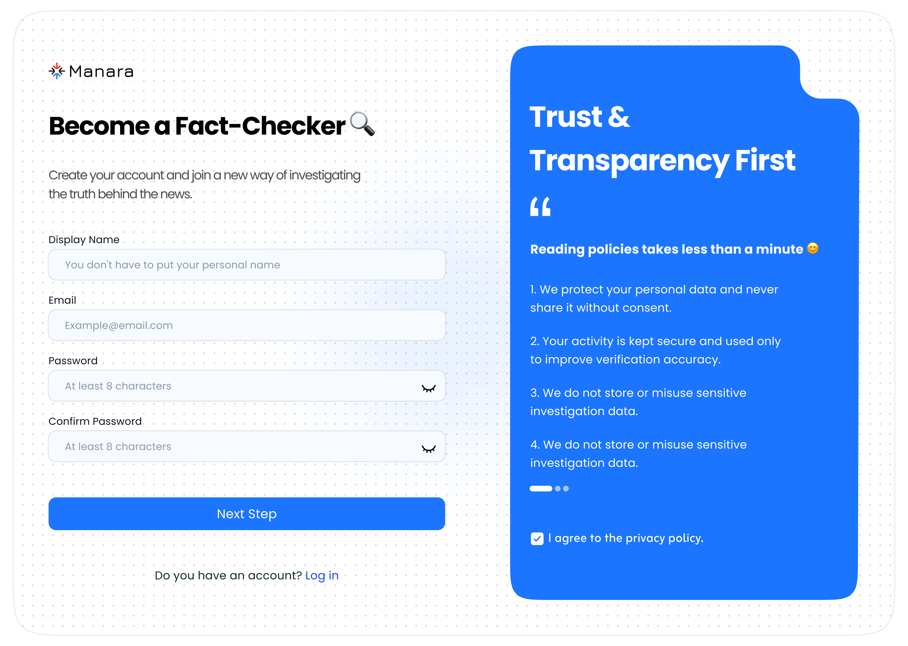
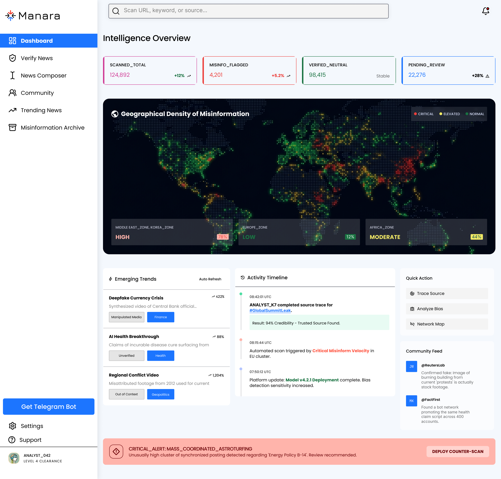
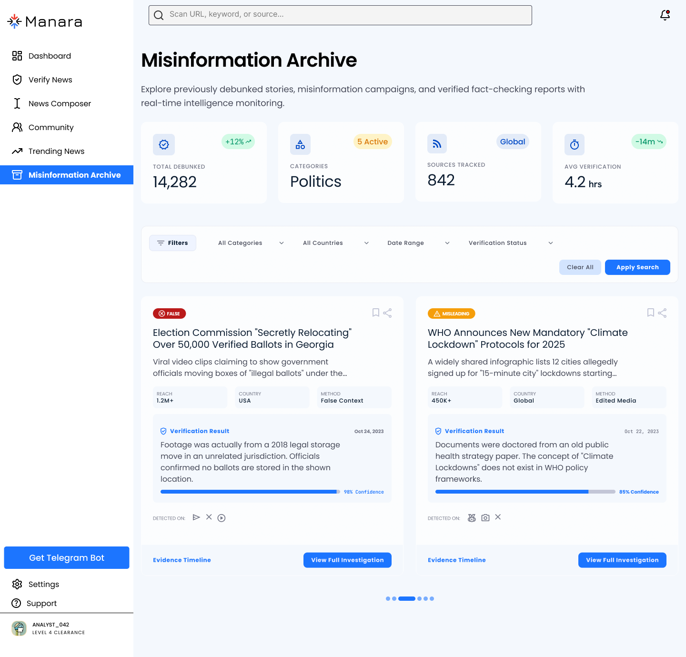

# 🔍 Manara — AI-Powered Investigative Journalism Platform

> **Verify, Trace, and Investigate — all in one platform.**

> Manara helps journalists and researchers track news back to its original source, verify credibility, and fight misinformation.

---

## 🖥️ Screenshots

### Landing Page

### Login

### Sign Up — Step 1

### Sign Up — Step 2

### Dashboard

### Verify News

### News Composer

### Misinformation Archive

---

## ✨ Key Features

- 🧠 **AI News Verification** — Analyze text, images, and videos for authenticity

- 🖼️ **Image Truth Check** — Detect manipulation, deepfakes, and metadata tampering

- 📝 **News Composer** — Write fact-based articles with AI-assisted neutrality scoring

- 🗂️ **Misinformation Archive** — Browse 14,000+ debunked stories with confidence scores

- 🌍 **Geographical Misinformation Map** — Real-time density tracking by region

- 🔎 **Smart Source Search** — Trace news origin across trusted outlets

- 👥 **Community Feed** — Collaborate with journalists and fact-checkers globally

---

## 🛠️ Built With

---

## 🚀 Getting Started

\`\`\`bash

git clone https://github.com/baraajuma3-lab/manara-website.git

cd manara-website

npm install

npm start

\`\`\`

---

## 👩‍💻 Author

**Baraa** — Frontend Developer & UI/UX Designer

---

> *Manara — The digital infrastructure for truth in an age of fragmented information.*

